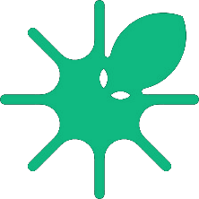

<div align="center">



# OctoView

**Natural-language DFIR for [Velociraptor](https://docs.velociraptor.app/).**

Ask in plain English. Get artifacts, flows, and live results.

[](https://react.dev)
[](https://vitejs.dev)
[](https://www.typescriptlang.org)
[](https://nodejs.org)
[](https://www.python.org)
[](https://docs.velociraptor.app)

</div>

---

## What it does

OctoView is a chat interface in front of Velociraptor. Pick endpoint clients from a sidebar, type a question like *"show me unsigned binaries running from %TEMP% on host X"*, and an LLM agent picks the right artifact, parameterizes it, schedules the collection, and streams rows back into the chat as the flow finishes.

> **Codename:**"velociprompt"

## Highlights

- **Two agent modes** — *VR mode* (clients selected) restricts the agent to Velociraptor tools; *local mode* (no clients) gives it general OS tools for ad-hoc work on the analyst host.
- **Live flow streaming** — when the agent schedules a collection, the UI opens a second SSE stream that polls the flow and appends rows as they land.
- **Threat-intel enrichment** — extract IoCs from a chat session and score them against VirusTotal and AbuseIPDB. Strictly read-only; allowlists are plain-text files you curate without code changes.
- **Session memory** — chats persist as JSONL; the agent loads recent turns plus a cross-session `MEMORY.md` so context survives reloads.
- **Custom agent builds** — package a Velociraptor client agent on demand from the UI.

## Architecture

```
Browser ──► Vite dev server ──► Express (server/index.js)
                                       │
                              stdin ──► agent.py (Python)
                                       │
                              vql_query.py ──► Velociraptor gRPC API
```

1. User submits prompt + selected `clientIds` → `POST /api/chat`.
2. Express spawns `agent.py`, pipes the request as JSON on stdin, streams stdout back as SSE.
3. `agent.py` runs a tool-call loop against an OpenAI-compatible LLM (NVIDIA NIM by default).
4. Velociraptor operations go through `vql_query.py`, a thin `pyvelociraptor` gRPC wrapper.
5. SSE events: `token`, `tool_call`, `tool_result`, `flow`, `status`, `done`, `error`.
6. On a `flow` event, the frontend opens `GET /api/stream` to poll the collection until done.

Protocol details: [`CLAUDE.md`](CLAUDE.md) and [`server/CLAUDE.md`](server/CLAUDE.md).

## Quickstart

### Prerequisites

- **Node.js 20+**
- **Python 3.10+** with a venv at `utils/venv/` (`pyvelociraptor`, `openai`, `python-dotenv`, `requests`)
- A running **Velociraptor** server with an API client config
- An **NVIDIA NIM** (or any OpenAI-compatible) API key

### 1. Clone & install

```bash
git clone https://github.com/<you>/velociprompt.git
cd velociprompt

npm install
cd server && npm install && cd ..
```

### 2. Configure

Create `server/.env` (template at `server/.env.example`):

```bash
NIM_API_KEY=nvapi-...                              # required
NIM_MODEL=meta/llama-3.3-70b-instruct              # optional
NIM_BASE_URL=https://integrate.api.nvidia.com/v1   # optional
VR_API_CONFIG=./api.config.yaml                    # mTLS config path
PORT=3001                                          # optional

# Threat intel (optional)
VT_API_KEY=...
ABUSEIPDB_API_KEY=...
```

Drop your Velociraptor API client config at `server/api.config.yaml`. **Never commit it** — it contains mTLS keys.

### 3. Run

```bash
# Terminal 1 — backend on :3001
cd server && npm start

# Terminal 2 — frontend on :8080 (proxies /api → :3001)
npm run dev
```

Open <http://localhost:8080>.


## Scripts

| Command | What it does |
|---|---|
| `npm run dev` | Vite dev server on :8080 |
| `npm run build` | Production build to `dist/` |
| `npm run lint` | ESLint |
| `npm run test` | Run Vitest once |
| `npm run test:watch` | Vitest watch mode |
| `cd server && npm run dev` | Backend with hot reload |
| `cd server && npm start` | Backend (production) |

### Invoking the agent directly

```bash
echo '{"prompt":"list clients","clientIds":[],"sessionId":"test"}' \
  | utils/venv/bin/python3 server/agent.py
```

## Project layout

```
.
├── src/                    # React + Vite frontend
│   ├── components/         # ChatThread, ClientSidebar, ThreatIntelButton, ...
│   ├── pages/              # Index (main UI), ThreatIntel, NotFound
│   └── hooks/              # useVelociraptorClients (polls /api/clients)
├── server/
│   ├── index.js            # Express: chat, stream, files, sessions, threat-intel
│   ├── agent.py            # Python AI agent (tool loop, session memory)
│   ├── vql_query.py        # pyvelociraptor gRPC CLI wrapper
│   ├── threat_intel.js     # IoC extraction + VT/AbuseIPDB scoring
│   ├── providers/          # virustotal.js, abuseipdb.js
│   ├── workspace/          # SOUL.md, IDENTITY.md, SKILL.md, MEMORY.md, allowlists
│   └── sessions/           # per-session JSONL transcripts
├── utils/
│   ├── venv/               # Python virtualenv
│   └── config/             # client.config.yaml for baked agents
└── outputs/                # full result rows saved by get_flow_results
```

## API reference

| Method | Path | Purpose |
|---|---|---|
| `GET`  | `/api/health` | Liveness |
| `GET`  | `/api/clients` | List Velociraptor clients (15s poll) |
| `POST` | `/api/chat` | Spawn agent, stream SSE response |
| `GET`  | `/api/stream` | Poll a flow until done (SSE) |
| `GET`  | `/api/sessions` | List chat sessions |
| `GET`  | `/api/sessions/:id/messages` | Replay a session |
| `POST` | `/api/threat-intel/:sessionId/scan` | Start IoC scan |
| `GET`  | `/api/threat-intel/:scanId/stream` | Stream scan results |
| `POST` | `/api/agents/build` | Build a Velociraptor client agent |

## Security

- `api.config.yaml` and `.env` are credentials — keep them out of git.
- Local-mode `bash` blocks `find /` (recursive root scans) but is otherwise permissive. Only run OctoView on a host where the operator is trusted to execute shell commands.
- Threat-intel allowlists (`server/workspace/allowlist_domains.txt`, `allowlist_hashes.txt`) reload on mtime change — curate freely without restarting the server.

## Acknowledgements

- [Velociraptor](https://docs.velociraptor.app/) — the DFIR platform underneath
- [NVIDIA NIM](https://build.nvidia.com/) — default LLM backend
- [VirusTotal](https://www.virustotal.com), [AbuseIPDB](https://www.abuseipdb.com) — IoC enrichment
